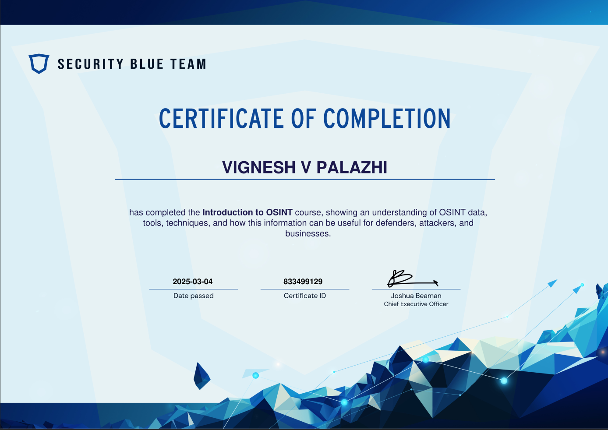
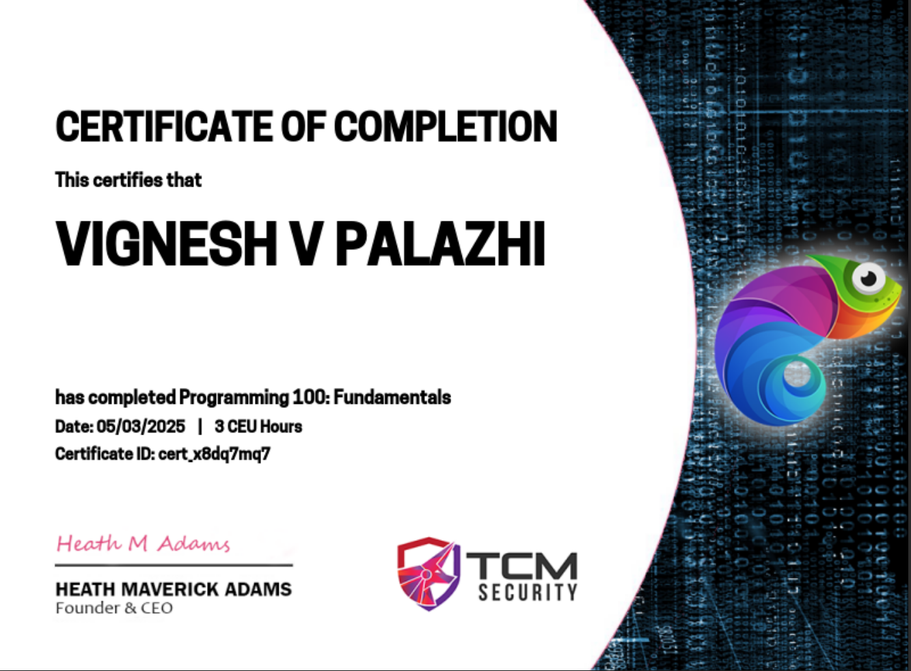
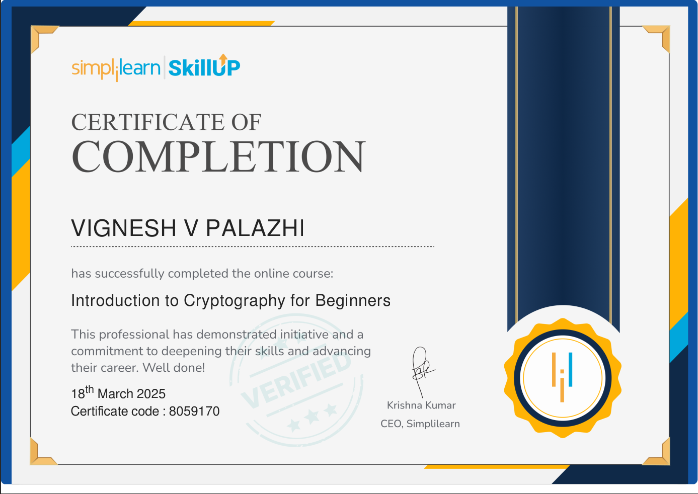

# Basic-Certifications

### Introduction to OSINT
from : Security Blue Team  
Issued Mar 2025Issued Mar 2025  
Credential ID 833499129 

----------------------------------------------------------------------------------------------

### Programming 100:Fundamentals
from : TCM Security 
Issued Mar 2025 
Credential ID cert_x8dq7mq7 

-----------------------------------------------------------------------------------------
###  Introduction to Cryptography for Beginners
from : Simplilearn 
Issued Mar 2025 
Credential ID 8059170 

